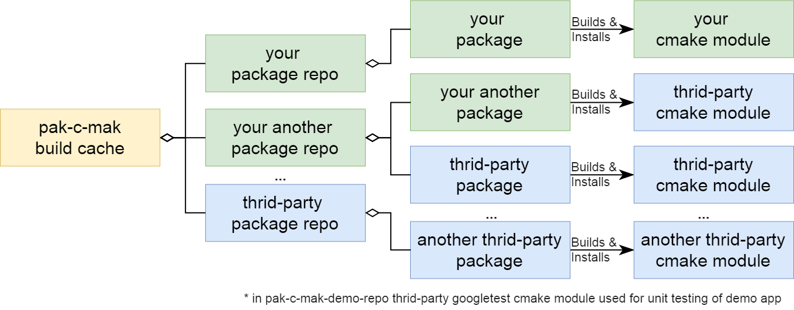

# Overview

**pak-c-mak** is cross-platform tools used as distributed package manager for C++ libraries. This tool was inspired by maven local and maven central repositories.

## How it works

Assume that it is required to create a cross-platform C++ multi-module application that re-uses C++ libraries as modules. 

- To share that C++ libraries for future re-use, it is necessary to create repository of libraries, particulary pak-c-mak repository is a git repository, wich contains pak-c-mak packages for every required C++ library, while each pak-c-mak package consists of URL to source code of C++ library, and required script to build and install that library as dependency to application.

- Sharing repository of libraries is as simple as hosting git. For open source libraries: GitHub can be used to publish repository of libraries. For proprietary libraries: corporate secure git server with locked external access can be used.

- To re-use libraries it is just necessary to add pak-c-mak repositories as url into local pak-c-mak configuration, so all packages of that repository became available. And then use pak-c-mak CLI to build and install pak-c-mak packages as CMake C++ libraries modules into cross-platform multi-module C++ application.

- **pak-c-mak** effectively can work with multiple pak-c-mak repositories, if another pak-c-mak repository with necessary C++ libraries already exist, using pak-c-mak it is possible to add as many references to external pak-c-mak repositories as needed.

- **pak-c-mak** have special mode for local development, where packages will be found in local copy first. This approach is useful to test latest local changes before publishing them into remote source code repository.



## Why was it created

The intention for this tool is to bring best practices to manage single cross-platform package repository for C++ projects. Java, Rust, Python already was designed specially for cross-platform development and have all necessary tools for that, however situation around C++ is different, C++ has longer history than any of these languages. C++ based platforms evolved independently to each other, and as a result there is no single cross-platform package managers for C++, instead 20 platform dependent exists. The intention for pak-c-mak is to make a solution for this situation.

In **Java** enterprise worlds, where web application could be very complex and contains hundreds and sometime up to thousand of transitive dependencies. Java binary executable format already made in that way, so different binary module already compatible even if they compiled for different platforms. So it makes possible for Java, to keep central repository for cross-platform binary artifacts like Maven central repository. Using java eco system it is easily possible to build an application from single command on any platform where only JDK is installed. Commonly adopted build tools like Maven and Gradle with support of maven repositories can be used for that. 

In **C++** worlds, CMake is commonly adopted tool for cross-platform module build, however maintaining binary compatibility between artifacts for different platform and C++ compiler versions is tricky thing. In C++ cross-platform development world it is easier to keep compatibility at source code level, and do the build for every platform independently, and keep series of binaries instead of creating single universal binary for every configuration of platform.
As example: googletest, boost and other recommends just to download library source coded and put it into project. It is still possible to install googletest or boost using deb manager for Ubuntu, vcpkg for Windows or etc, but in this case it will be platform dependent way, project can be distributed to platform only with compatible package repository, and it will not be cross-platform approach.

The cross-platform central binary repository for Cross-Platform C++ will never happen, however based on **Rust** experience, which has same limitation like C++, it is efficient to manage dependencies as modules with buildable source code.

## Solution

**Git** and **CMake** already provides all necessary tools for cross-platform C++ build and compilation.

**pak-c-mak** is simply set of script that provide single command line interface same for any platform, eliminating usage difference that exists for CLI and scripting on different platforms.

**Git** is distributed version control system.
- On Linux it is just DVCS.
- On Windows it is also provides as dependency bash eco system, that is enough to write cross platform scripts for Linux, Unix, Windows, Mac is etc. 

**CMake** is perfect tool for C++ that can be used to install binaries of C++ libraries into cross-platform way. 

# Features

**pak-c-mak** provides following features:
- **Package manager** for C++ modules and dependencies between them.
- **Local build cache repository** to install built target, decoupled from OS binaries.
- **pak-c-mak repositories**: Git based repository to keep packages and profiles.
- **pak-c-mak package** - reference to C++ CMake based module's source codes and script to build it and install into local binary repository for future use.
- **Profiles** to define different preset for built configuration.
- Two ways of use: 
  - **Distribution mode**: Automated build from remote git repositories. C++ modules are download from remote git repositories.
  - **Development mode**: Used to debug local changes to C++ modules. C++ modules are found on local workstation.
  
For complete command list please run help command: [pak-c-mak help](commands/pak-c-mak-help)

# Requirements


**pak-c-mak** requires these software installed before starting use of **pak-c-mak**:

- **CMake** - https://cmake.org/
- **Git** - https://git-scm.com/
- **C++ Build Tool** - one of built tool compatible with CMake generators, more info about CMake generators can be found here: https://cmake.org/cmake/help/v3.0/manual/cmake-generators.7.html
  - on ***Windows*** it could be ***MS Visual Studio***
  - on ***Linux*** it could be ***build-essential*** package
- **bash utilities**
  - ***dirname***
  - ***perl***
  - ***sed***

# Supported Platforms

- Windows
- Linux
- OS X [not tested yet]
- BSD Unix [not tested yet]
  
# Examples

**pak-c-mak** example is presented by **pak-c-mak-demo-app**, which have ***googletest*** as third-party dependency, and **pak-c-mak-demo-repo** that contains packages to build **pak-c-mak-demo-app** and ***googletest***.

- **pak-c-mak-demo-repo** - https://github.com/amidukr/pak-c-mak-demo-repo
- **pak-c-mak-demo-app** - https://github.com/amidukr/pak-c-mak-demo-app
- ***googletest*** - is very nice framework for C++ unit testing created by Google, and is used as example of third-party dependency: https://github.com/google/googletest

## Installing pak-c-mak-demo-app

Installing required packages for **pak-c-mak**
```shell
sudo apt-get update
sudo apt-get -y install git
sudo apt-get -y install cmake
sudo apt-get -y install build-essential
```

Cloning **pak-c-mak**
```shell
git clone https://github.com/amidukr/pak-c-mak
  Cloning into 'pak-c-mak'...
  ...
```  

Adding **pak-c-mak** demo repository with packages and profiles
```shell
./pak-c-mak/pak-c-mak add-repo pak-c-mak-demo-repo https://github.com/amidukr/pak-c-mak-demo-repo master
```

Verifying if packages are successfully installed.
```shell
./pak-c-mak/pak-c-mak list
  googletest
  pak-c-mak-demo-app
  pak-c-mak-demo-app-with-deps
```

Building and installing googletest
```shell
./pak-c-mak/pak-c-mak install googletest
  Cloning into '/home/vagrant/pak-c-mak-test/pak-c-mak/pak_c_mak_tmp/downloads/packages/googletest'...
  ...
  [100%] Built target gtest_main
  Install the project...
  -- Install configuration: ""
  -- Installing: /home/vagrant/pak-c-mak-test/pak-c-mak/cache/lib/libgmock.a
  -- Installing: /home/vagrant/pak-c-mak-test/pak-c-mak/cache/lib/libgmock_main.a
  ...
```
  
Building and installing **pak-c-mak** demo application
```shell
./pak-c-mak/pak-c-mak install pak-c-mak-demo-app
  Cloning into '/home/vagrant/pak-c-mak-test/pak-c-mak/pak_c_mak_tmp/downloads/packages/pak-c-mak-demo-app'...
  ...
  [100%] Built target pak_c_mak_demo_app_executable
  Install the project...
  -- Install configuration: ""
  -- Installing: /home/vagrant/pak-c-mak/cache/lib/libpak_c_mak_demo_app_library.a
```

Verifying that **pak-c-mak** demo application successfully installed.
```shell
./pak-c-mak/cache/bin/pak_c_mak_demo_app_executable
  MyHoldVariable of MyHolderClass
```
  
## Development Mode

Cloning **pak-c-mak** demo application sources
```shell
git clone https://github.com/amidukr/pak-c-mak-demo-app
  Cloning into 'pak-c-mak-demo-app'...
```

Updating **pak-c-mak** demo application printed text
```shell
vi ./pak-c-mak-demo-app/src/myholderclass.cpp
```

to something like that:
```c++
  #include<myholderclass.hpp>

  const char* MyHolderClass::GetHoldVariable() {
    return "MyHoldVariable of MyHolderClass updated text";
  };
```

Enabling **pak-c-mak** development mode, so package will be searched on local first.
```shell
export PAK_C_MAK_LOCAL_PACKAGES=*
```

Building and installing **pak-c-mak** demo application again
```shell
./pak-c-mak/pak-c-mak install pak-c-mak-demo-app
  Cloning into '/home/vagrant/pak-c-mak-test/pak-c-mak/pak_c_mak_tmp/downloads/packages/pak-c-mak-demo-app'...
  ...
  [100%] Built target pak_c_mak_demo_app_executable
  Install the project...
  -- Install configuration: ""
  -- Installing: /home/vagrant/pak-c-mak/cache/lib/libpak_c_mak_demo_app_library.a
```
  
Verifying that locally changed copy of **pak-c-mak** demo application is installed.
```shell
./pak-c-mak/cache/bin/pak_c_mak_demo_app_executable
  MyHoldVariable of MyHolderClass updated text
```
## Creating pak-c-mak repository

To create your pak-c-mak repository, just simply use [pak-c-mak-demo-repo](https://github.com/amidukr/pak-c-mak-demo-repo) as template for your repository.

## Build using CMake CMAKE_PREFIX_PATH

To access artifacts installed into pak-c-mak cache, CMAKE_PREFIX_PATH variable could be used for CMake based modules. More information about this variable can be found in CMake official documentation.

https://cmake.org/cmake/help/latest/variable/CMAKE_PREFIX_PATH.html

To configure CMAKE_PREFIX_PATH variable for using pak-c-mak cache, please use following command:

```shell
source ./pak-c-mak/pak-c-mak-env
```

## Cleaning CMake build cache

Some changes to CMakeLists.txt file may require cleaning of cmake build cache, please use following command:
```shell
./pak-c-mak/pak-c-mak clean-cmake-build
```

# Contribution

If you would like to contribute - any help would be appreciated:
- The platform currently was not tested on OS X and BSD platform, so looking for feedbacks.
- If you've found this tool useful and you are keeping pak-c-mak repositories with your modules, please let know, will keep DB updated with list of public pak-c-mak repositories.
- Project team is open for any suggestions and improvements.

# Contacts
For any question feel free to contact me: **Dmytro Brazhnyk** <<amid.ukr@gmail.com>>
